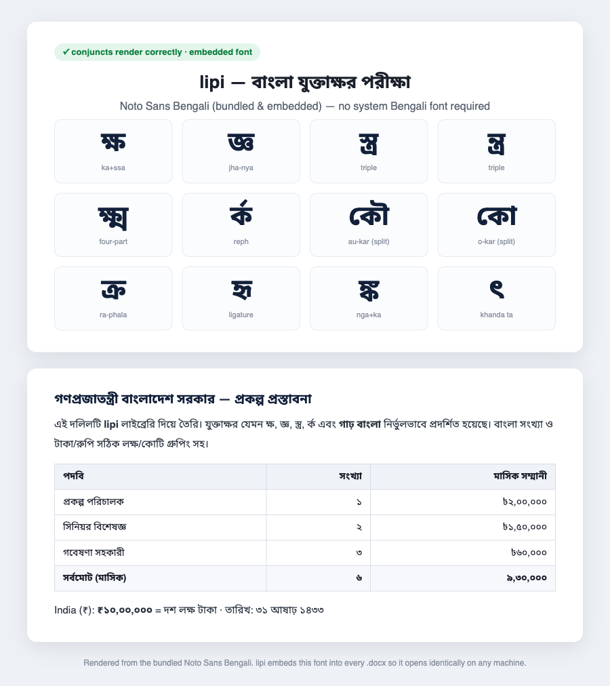

# lipi — correct Bengali (বাংলা) DOCX & PDF from Node.js

[](https://github.com/bemoshiur/Bengali-Docgen-docx-PDF-production-grade/actions/workflows/ci.yml)
[](https://github.com/bemoshiur/Bengali-Docgen-docx-PDF-production-grade/actions/workflows/publish.yml)


> **[বাংলায় পড়ুন → README.bn.md](./README.bn.md)**

The library that did not exist: **correct Bengali DOCX and PDF generation from
Node.js** — conjuncts, embedded fonts, and page-accurate tables of contents, all
at once. Output opens correctly in **MS Word, LibreOffice and Pages** with **no
Bengali font installed on the machine**, because the font travels inside the file.



<sub>A real render of `tests/fixtures/conjuncts.txt` + a sample government document, using the bundled Noto Sans Bengali font. Split matras (কৌ, কো), reph (র্ক), the four-part ক্ষ্ম and khanda-ta (ৎ) all shape correctly — with Bengali numerals and ৳/₹ lakh–crore grouping.</sub>

**Built for Bangladesh 🇧🇩 and India 🇮🇳.** Bengali is the language of ~270M
people — Bangladesh plus West Bengal, Assam and Tripura in India. Every
government office, NGO and enterprise there generates reports and hits the same
wall. `lipi` is the wall coming down. It speaks both `bn-BD` and `bn-IN`, and
formats both **Taka (৳)** and **Rupee (₹)** with correct lakh/crore grouping.

> **Free and open source (MIT). Download it, use it, ship it — commercially or
> not — free, forever.** No license fees, no lock-in. See [LICENSE](./LICENSE).

---

## Contents

- [The problem](#the-problem)
- [Why it's hard — the three bugs everyone hits](#why-its-hard--the-three-bugs-everyone-hits)
- [Quickstart](#quickstart)
- [Features in depth](#features-in-depth)
- [Architecture](#architecture)
- [Deep dive: font embedding (the crown jewel)](#deep-dive-font-embedding-the-crown-jewel)
- [Deep dive: the static TOC](#deep-dive-the-static-toc)
- [API reference](#api-reference)
- [Bengali utilities](#bengali-utilities)
- [PDF generation](#pdf-generation)
- [Testing — the tests are the product](#testing--the-tests-are-the-product)
- [Language ports](#language-ports)
- [Verification status](#verification-status)
- [Roadmap & non-goals](#roadmap--non-goals)
- [Contributing](#contributing)
- [License](#license)

---

## The problem

Every existing option for Bengali documents is an example repo, a blog post
about hacking `config_fonts.php`, or a micro-package. Nobody had shipped a
maintained library that gets **conjuncts, font embedding, and page-accurate
TOCs** right at the same time. That is the entire product.

<table>
<tr><th>❌ typical <code>docx</code>/<code>pdfmake</code> output</th><th>✅ lipi</th></tr>
<tr>
<td>Bengali routed to the default font → tofu / broken conjuncts. Bold doesn't
apply. Fonts not embedded, so it only works on <em>your</em> machine. TOC empty
when generated headlessly.</td>
<td><code>ক্ষ</code> <code>জ্ঞ</code> <code>কৌ</code> <code>র্ক</code> render
correctly everywhere; bold Bengali is bold; the font is embedded; the TOC has
real page numbers.</td>
</tr>
</table>

<sub>Regenerate the DOCX→PDF proof image with <code>node scripts/comparison.ts</code> inside <code>Dockerfile.test</code> (needs LibreOffice).</sub>

## Why it's hard — the three bugs everyone hits

Bengali is a **complex script**. The failures are always the same three, and
they are the moat:

1. **`w:rFonts` without `w:cs`.** Word/LibreOffice route complex-script text to a
   separate *complex-script font slot*. Set only `w:ascii`/`w:hAnsi` and Bengali
   silently falls back to Times/Arial → tofu. `lipi` sets `w:cs` (and the
   matching `w:szCs`) on **every run** and in the document defaults.
2. **Bold/italic need `w:bCs`/`w:iCs`.** `<w:b/>` bolds only the ASCII slot;
   `lipi` always emits the complex-script twin, so Bengali bold actually bolds.
3. **The `TOC` field never updates headlessly.** Convert with LibreOffice and you
   get an empty TOC. `lipi` writes a **static, pre-computed** TOC with real,
   clickable page numbers — the only correct answer for CI pipelines.

Every generated file is asserted against these in the test suite. Full write-up
in [BUILD_PROMPT.md](./BUILD_PROMPT.md) §2 and [CLAUDE.md](./CLAUDE.md).

## Quickstart

**Install** (published to GitHub Packages under `@bemoshiur`):

```bash
# .npmrc in your project
@bemoshiur:registry=https://npm.pkg.github.com
# then
npm install @bemoshiur/lipi @bemoshiur/lipi-fonts
```

Prefer no auth? Grab the **tarballs** from the [latest release](https://github.com/bemoshiur/Bengali-Docgen-docx-PDF-production-grade/releases) and `npm install ./bemoshiur-lipi-*.tgz`. Or clone and `pnpm install && pnpm build`.

**Use it** — the whole API in eight lines:

```ts
import { Document, Heading, Para, Table, TOC } from '@bemoshiur/lipi';
import { hindSiliguri } from '@bemoshiur/lipi-fonts';

const doc = new Document({
  lang: 'bn-BD',
  font: hindSiliguri,          // embedded automatically
  numerals: 'bengali',          // ০১২ in TOC, tables, page refs
  margins: { top: 25, right: 25, bottom: 25, left: 30 }, // mm
});

doc.section({ pageNumbers: { format: 'lowerRoman', start: 1 } })
   .add(new TOC({ levels: [1, 3], title: 'সূচিপত্র' }));

doc.section({ pageNumbers: { format: 'decimal', start: 1 } })
   .add(new Heading(1, 'প্রকল্পের পটভূমি'))
   .add(new Para('গণপ্রজাতন্ত্রী বাংলাদেশ সরকারের...'))
   .add(Table.from(rows, { header: true, widths: ['40%', '30%', '30%'] }));

await doc.toDocx('out.docx');
await doc.toPdf('out.pdf');    // requires LibreOffice (soffice) on PATH
```

Or try the demo with no code:

```bash
npx @bemoshiur/lipi demo ./out    # writes out/demo.docx (+ demo.pdf if LibreOffice is installed)
```

## Features in depth

**Correct complex-script rendering**

- `w:cs` + `w:szCs` on **every** run and in `w:docDefaults` — Bengali never falls back.
- `w:b`+`w:bCs` and `w:i`+`w:iCs` emitted together — bold/italic Bengali actually applies.
- Canonical `CT_RPr` / `CT_Font` element ordering — Word never shows a "repair" dialog.
- Bidi `w:lang` (`bn-BD` / `bn-IN`) so the shaper fires.

**Font embedding — works with zero fonts installed**

- Fonts embedded as obfuscated `.odttf` per ECMA-376 §17.8.1.
- The **real** `OS/2` Unicode signature (`w:sig`) is parsed from the font — Bengali is `ulUnicodeRange1` bit 16; declare it wrong and Word falls back anyway.
- Verified: the packaged `.odttf` deobfuscates **byte-for-byte** back to the original TTF.
- Regular / bold / italic / bold-italic faces, each with its own font key.

**Page-accurate, static TOC**

- No `TOC` field — a pre-computed TOC that survives headless conversion.
- Front-matter and body get independent page numbering (roman `i, ii` → decimal `1, 2`), so TOC length never shifts body page numbers.
- Right tab-stop **dot leaders**, clickable internal **hyperlinks** + **bookmarks**, page numbers in Bengali numerals.

**Document model**

- Headings (H1–H9, auto outline level + bookmark + TOC marker), paragraphs, rich runs (bold/italic/underline/strike/color/size/superscript/subscript), page breaks.
- Tables with percentage or twip column widths, header-row repeat, cell shading, column spans, vertical merges.
- **BoQ helper** — item / unit / qty / rate / amount with an auto-computed total in Bengali numerals, the single most common real-world Bengali document element.
- Multiple sections; per-section page size (A4 default), margins (mm), orientation, headers & footers.

**Bengali/South-Asian utilities** (also at `@bemoshiur/lipi/bangla`)

- `toBengaliNumerals` / `toAsciiNumerals`.
- `formatTaka` (৳) and `formatRupee` (₹) with **lakh/crore grouping** — `৳১০,০০,০০০`, not `1,000,000`.
- `takaInWords` — full 0–99 Bengali table + কোটি/লক্ষ/হাজার scale (`দশ লক্ষ টাকা`).
- `formatBanglaDate` — revised-Bangladesh Bangabda calendar (`৩১ আষাঢ় ১৪৩৩`).

**PDF output** — optional LibreOffice adapter, concurrency-safe, clear errors.

**Correctness tooling** — 33 unit tests, `xmllint` schema validation of element ordering, and a Docker visual-regression harness (docx → pdf → png → pixelmatch).

**Multi-language ports** — the core primitives in Python, Ruby, PHP, C#, Java, Go.

## Architecture

DOCX is the source of truth; PDF is a downstream conversion. `lipi` writes OOXML
directly (no dependency on `docx`/`pdfmake`) and lets Word/LibreOffice's
battle-tested Indic shapers do the shaping — it never reimplements reph
reordering or split matras in JS.

```text
User doc model  →  OOXML writer  →  .docx  →  [LibreOffice adapter]  →  .pdf
   (fluent API)     (pure JS)                    (optional peer)
```

```text
packages/
├── lipi/                     @bemoshiur/lipi
│   └── src/
│       ├── model/            Document, Section, Para, Heading, Table, Boq, TOC → AST
│       ├── ooxml/            document.xml, styles, settings, fontTable, sectPr, rels, zip
│       ├── fonts/            obfuscate (.odttf), os2 (w:sig), register
│       ├── bangla/           numerals, currency (৳/₹), Bangabda date
│       ├── toc.ts            static TOC + marker extraction
│       └── pdf/              LibreOffice adapter
└── fonts/                    @bemoshiur/lipi-fonts — OFL fonts + licences
ports/                        python · ruby · php · csharp · java · go
```

## Deep dive: font embedding (the crown jewel)

This is why the output works on a machine with zero Bengali fonts installed —
and why nobody else does it.

1. Each font face gets a GUID **font key** and is XOR-obfuscated into `.odttf`
   (ECMA-376 §17.8.1): the first 32 bytes are XORed with the 16 GUID bytes
   **reversed**, applied twice. The transform is symmetric.
2. The font's real `OS/2` table is parsed for `ulUnicodeRange1..4` →
   `w:sig/@usb0..3` and `ulCodePageRange1..2` → `@csb0..1`. **Never hardcoded.**
3. `fontTable.xml` declares `embedRegular`/`embedBold`/… pointing at the parts;
   `settings.xml` sets `<w:embedTrueTypeFonts/>`; `[Content_Types].xml` maps the
   `.odttf` extension to `application/vnd.openxmlformats-officedocument.obfuscatedFont`.
4. The round-trip is tested: extract the embedded `.odttf`, deobfuscate, and
   assert it is byte-identical to the source TTF — proven across all six language
   ports too.

## Deep dive: the static TOC

The naive two-pass fixed-point loop (render → find page numbers → re-render →
numbers shifted because the TOC added pages → repeat) is ugly and sometimes
non-convergent. `lipi` collapses it:

- Front matter (TOC) and body live in **separate sections** with independent
  `w:pgNumType` (`lowerRoman start=1` → `decimal start=1`). TOC length can't
  change body page numbers.
- Pass 1 renders a **body-only** DOCX with a 1pt, white, ASCII marker in each
  heading paragraph, converts to PDF, and reads marker → page number from the
  text layer (so a marker's physical PDF page equals its body page number).
- Pass 2 renders front matter + TOC (with those numbers) + body. One extra
  render, deterministic, no loop.

Without LibreOffice, the TOC still renders — clickable, with dot leaders, just
without page numbers.

## API reference

```ts
new Document(opts: DocumentOptions)
  .section(props?: SectionProps): Section     // chainable
  .toDocx(path, opts?): Promise<void>
  .toDocxBuffer(opts?): Promise<Uint8Array>
  .toPdf(path, opts?): Promise<void>          // needs soffice

section.add(...blocks: Block[]): Section       // chainable
```

**`DocumentOptions`**

| Option | Type | Default | Notes |
|---|---|---|---|
| `font` | `FontInput \| RegisteredFont` | — | embedded automatically |
| `lang` | `string` | `'bn-BD'` | complex-script/bidi locale (`bn-IN` too) |
| `numerals` | `'bengali' \| 'ascii'` | `'bengali'` | for TOC, tables, BoQ |
| `margins` | `{top,right,bottom,left,header?,footer?}` mm | 25/25/25/30 | per-doc default |
| `baseFontSizePt` | `number` | `12` | body text size |

**Blocks**

| Block | Signature |
|---|---|
| `Heading` | `new Heading(level: 1–9, text \| runs, props?)` |
| `Para` | `new Para(text \| run \| runs, props?)` |
| `Table` | `Table.from(rows, { header?, widths?, borders?, layout?, align? })` |
| `Boq` | `new Boq(items: {item,unit,qty,rate}[], opts?)` — auto-total |
| `TOC` | `new TOC({ levels?: [min,max], title? })` |
| `PageBreak` | `new PageBreak()` |

**Rich runs**: `text(str, { bold, italic, underline, strike, color, sizeHalfPt, fontName, superscript, subscript })`, plus `tab()` and `lineBreak()`.

**Your own fonts**: `registerFont({ name, regular, bold?, italic?, boldItalic? })` — paths or `Uint8Array`. You are responsible for their licence.

## Bengali utilities

```ts
import {
  toBengaliNumerals, formatTaka, formatRupee, takaInWords, formatBanglaDate,
} from '@bemoshiur/lipi/bangla';

toBengaliNumerals(1234567)             // "১২৩৪৫৬৭"
formatTaka(1000000)                    // "৳১০,০০,০০০"   (Bangladesh)
formatRupee(1000000)                   // "₹১০,০০,০০০"   (India)
formatTaka(1000000, { words: true })   // "দশ লক্ষ টাকা"
formatTaka(1234.5, { decimals: 2 })    // "৳১,২৩৪.৫০"
formatBanglaDate(new Date('2026-07-15')) // "৩১ আষাঢ় ১৪৩৩"
```

South-Asian grouping is *last three digits, then groups of two* — get it wrong
and every accountant in BD/West Bengal notices.

## PDF generation

`await doc.toPdf('out.pdf')` shells out to headless LibreOffice (`soffice` on
PATH; set `LIPI_SOFFICE` to override). It is concurrency-safe (a unique
`-env:UserInstallation` per call), kills runaway processes on a timeout, and
throws a clear, actionable error if LibreOffice is missing. `toDocx` needs
nothing extra. Reproducible setup in [`Dockerfile.test`](./Dockerfile.test).

## Testing — the tests are the product

Nobody else ships **visual regression tests for Bengali**. `lipi` does:

```text
docx → soffice → pdf → pdftoppm → pixelmatch vs baseline   (pnpm test:visual)
```

Golden XML passing means nothing about whether `ৌ` and `র্ক` actually render —
only the visual test proves that. The unit suite additionally asserts the three
bugs are fixed in every output, checks the `.odttf` round-trip, and validates
`w:rPr`/`w:font` element ordering against a WordprocessingML schema with
`xmllint`.

```bash
pnpm test          # 33 unit tests + OOXML invariants + schema validation
pnpm test:visual   # Docker + LibreOffice + pixel baselines
pnpm validate:xml  # xmllint well-formedness + rPr/font ordering
pnpm spike         # the §15 odttf de-risk spike
```

## Language ports

The full document writer is TypeScript-first, but the two most reusable
primitives — **`.odttf` font embedding** and **Bengali numerals/currency** — are
ported to other languages in [`ports/`](./ports). Each is a single self-testing
file that proves the `.odttf` round-trip is byte-identical against the bundled
font.

| Language | Run | Verified |
|---|---|:--:|
| Python | `python3 ports/python/lipi_core.py` | ✅ |
| Ruby | `ruby ports/ruby/lipi_core.rb` | ✅ |
| PHP | `php ports/php/lipi_core.php` | ✅ |
| C# | `cd ports/csharp && dotnet run` | ✅ |
| Java | `javac ports/java/LipiCore.java && java -cp ports/java lipi.LipiCore` | mirrors verified logic |
| Go | `go run ports/go/lipicore.go` | mirrors verified logic |

## Verification status

| Capability | Status |
|---|---|
| `.odttf` embedding + byte-exact round-trip | ✅ verified (JS + 6 ports) |
| Three complex-script bugs fixed in output | ✅ asserted every build |
| OOXML schema (rPr/font ordering) | ✅ `xmllint` in CI |
| Bengali numerals / Taka / Rupee / Bangabda | ✅ unit-tested |
| Browser render of all conjuncts | ✅ (screenshot above) |
| DOCX→PDF visual regression | ⏳ CI/Docker (needs LibreOffice) |
| Opens in MS Word with no repair dialog | ⏳ manual gate (see JOURNEY.md) |

Honest by design — see [JOURNEY.md](./JOURNEY.md) for what's proven vs. gated.

## Roadmap & non-goals

**Not in v1**: reading/editing existing `.docx`, templating DSLs, charts/shapes,
Bijoy/SutonnyMJ conversion, browser builds, font subsetting (a naive subset
drops conjuncts). Library only — no web service.

**Roadmap**: `harfbuzzjs` closure-based font subsetting; a direct PDF writer;
fuller language ports (the whole writer, not just the primitives); more conjunct
fixtures and committed visual baselines.

## Contributing

Contributions welcome — bug reports, conjunct fixtures, and especially fuller
language ports. Read [CONTRIBUTING.md](./CONTRIBUTING.md) and [CLAUDE.md](./CLAUDE.md)
(the three complex-script rules) before touching the OOXML writer, and append a
note to [JOURNEY.md](./JOURNEY.md).

## License

**Free and open source, forever.**

- `@bemoshiur/lipi` and all language ports — **MIT** ([LICENSE](./LICENSE)). Use,
  modify, distribute and sell freely, including commercially. Just keep the
  copyright notice.
- Bundled fonts in `@bemoshiur/lipi-fonts` — **SIL OFL-1.1** (also free/libre);
  each font's licence travels with it and is printed by `lipi licenses`. See
  [NOTICE](./NOTICE).

Author: **S M Moshiur Rahman** · bemoshiur@gmail.com · +8801717714676 (WhatsApp only)
